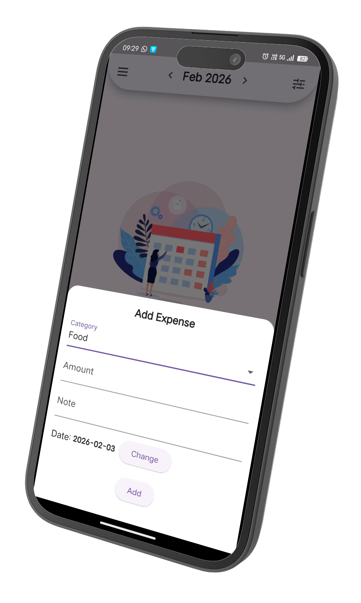
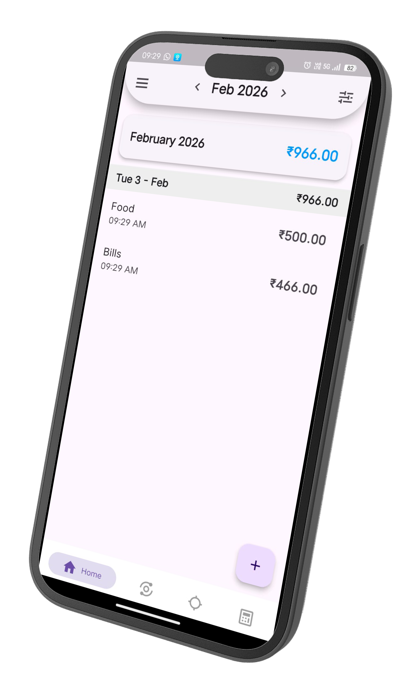
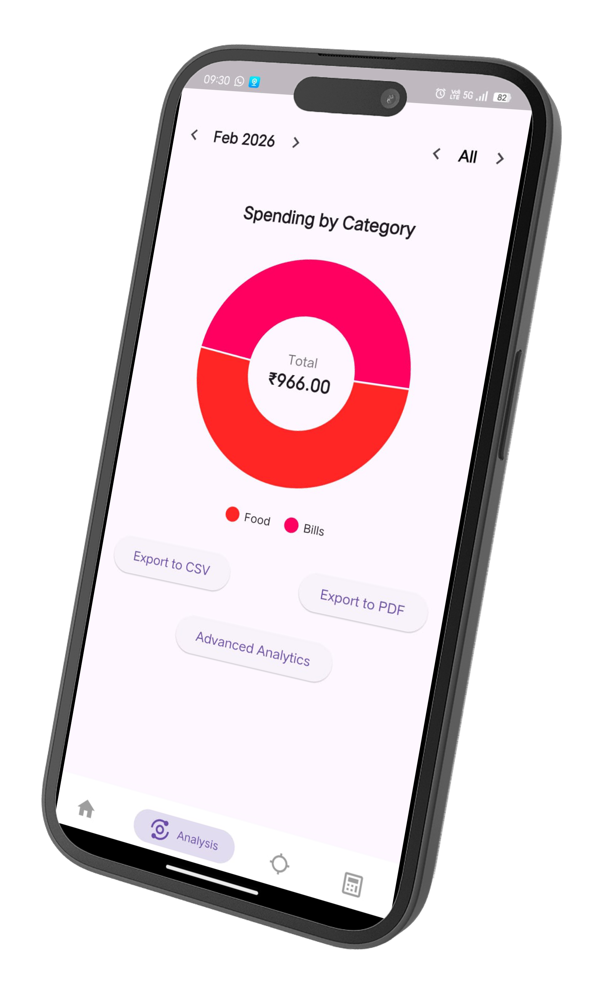
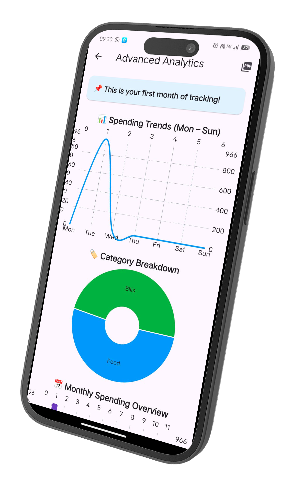
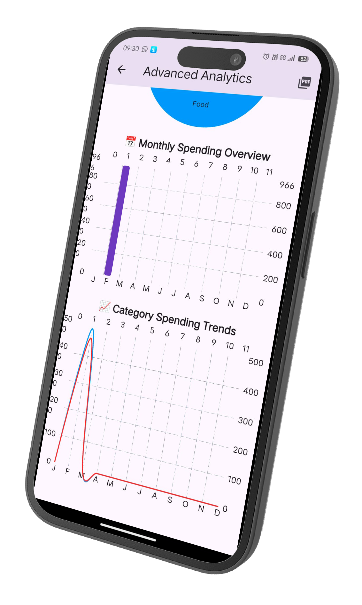
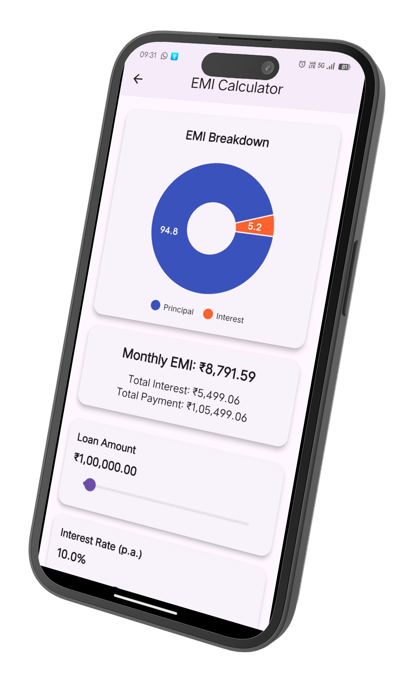
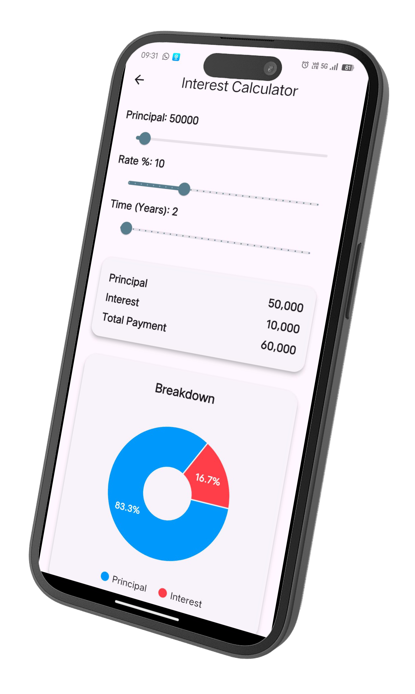

# Expense Tracker – Flutter App 💸

A cross-platform **Flutter Expense Tracker application** that helps users
track daily expenses, categorize spending, and view summaries with a clean
and intuitive UI.

This app is built using Flutter and works on **Android and iOS** from a single
codebase.

---

## 🚀 Features

- Add, edit, and delete expenses
- Expense categories
- Daily / monthly expense summary
- Clean and responsive UI
- Offline support (local storage)
- Additional Calculators - EMI and Interest Calculator
- Dark And Light Theme 🌙
- Export to PDF and CSV
- Advanced Analytics
- Financial Goals
- Cross-platform (Android & iOS)

---

## 🛠️ Tech Stack

- Flutter (Dart)
- State Management: (GetX )
- Local Storage: (GetStorage / SQLite)

---

## 📸 Screenshots

<table>
  <tr>
    <td></td>
    <td></td>
    <td></td>
  </tr>
  <tr>
    <td align="center">Home Screen</td>
    <td align="center">Add Expense</td>
    <td align="center">Expense List</td>
  </tr>
  <tr>
    <td></td>
    <td></td>
    <td></td>
  </tr>
  <tr>
    <td align="center">Analytics with export options</td>
    <td align="center">Advanced Analytics</td>
    <td align="center">Advanced Analytics</td>
  </tr>
  <tr>
    <td></td>
    <td></td>
    <td></td>
  </tr>
  <tr>
    <td align="center">EMI Calculator</td>
    <td align="center">Interest Calculator</td>
    <td align="center">Goals</td>
  </tr>
</table>

---

## ⚙️ Getting Started

### Prerequisites

- Flutter SDK
- Android Studio / VS Code
- Android Emulator or Physical Device

### Installation

```bash
git clone https://github.com/Yashwanth-nelfys/Expense-Tracker.git
cd Expense-Tracker
flutter pub get
flutter run
```
